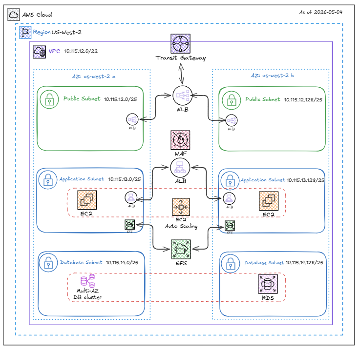

# Solutions Architect Document — DCCA WordPress

**Site:** https://cca.hawaii.gov
**Owner:** Hawaii Department of Commerce and Consumer Affairs (DCCA)
**Region:** us-west-2 (Oregon)
**Last Updated:** 2026-03-03

---

## Table of Contents

1. [Executive Summary](#1-executive-summary)
2. [Architecture Diagram](#2-architecture-diagram)
3. [Account & Network Architecture](#3-account--network-architecture)
4. [Compute Architecture](#4-compute-architecture)
5. [Data Architecture](#5-data-architecture)
6. [Security Architecture](#6-security-architecture)
7. [CI/CD Pipeline](#7-cicd-pipeline)
8. [High Availability & Disaster Recovery](#8-high-availability--disaster-recovery)
9. [Monitoring & Observability](#9-monitoring--observability)
10. [Cost Considerations](#10-cost-considerations)
11. [Known Limitations & Technical Debt](#11-known-limitations--technical-debt)
12. [Decision Log](#12-decision-log)

---

## 1. Executive Summary

This document describes the architecture of the DCCA WordPress platform hosted on AWS. The site serves the Hawaii Department of Commerce and Consumer Affairs at https://cca.hawaii.gov.

### Design Principles

- **Immutable Infrastructure** — servers are never patched in place. A new AMI is built, and instances are replaced via rolling refresh.
- **Infrastructure as Code** — all resources defined in Terraform modules, versioned in Git, deployed via GitHub Actions.
- **Least Privilege** — every IAM role scoped to minimum required permissions. No SSH keys, no long-lived credentials.
- **Multi-AZ High Availability** — all stateful and stateless components span two Availability Zones.
- **Separation of Environments** — dev and prod run in separate AWS accounts with independent VPCs.

### Technology Stack

| Layer | Technology |
|---|---|
| CDN / WAF | Cloudflare APO + AWS WAFv2 |
| Load Balancer | ALB (application) + NLB (network, static IPs) |
| Compute | EC2 (t3.medium), Ubuntu 24.04, Nginx, PHP 8.4-FPM |
| Database | RDS MySQL 8.0 (Multi-AZ) |
| Shared Storage | EFS (NFS mounted at `/var/www/html`) |
| Secrets | SSM Parameter Store |
| CI/CD | GitHub Actions + OIDC federation |
| IaC | Terraform 1.10, Packer, Ansible |
| Backup | AWS Backup (EFS), RDS automated snapshots |

---

## 2. Architecture Diagram



The diagram shows a single environment (prod). Dev mirrors the same topology in a separate AWS account; sandbox is currently dormant (workload destroyed, foundation network preserved).

**Read it top to bottom:**
- **Transit Gateway** at the VPC boundary handles north-south traffic (Cloudflare → workload via private path) and east-west traffic between VPCs. There is no Internet Gateway on the workload VPC.
- **Public subnets** (one per AZ) host the **Network Load Balancer** with private static IPs — Cloudflare's origin points here. NAT Gateways for egress are also in this tier (or routed via TGW to a centralized egress VPC).
- **Application subnets** (one per AZ) host the internal **Application Load Balancer**, the **Auto Scaling Group** of EC2 instances running Nginx + PHP-FPM + WordPress, and **EFS mount targets**. **AWS WAFv2** is attached to the ALB.
- **Database subnets** (one per AZ) host the **RDS MySQL Multi-AZ** primary and standby. No internet route.
- **EFS** is shared across both AZs and mounted at `/var/www/html` on every EC2.

**Traffic flow:** End User → Cloudflare → TGW → NLB (443) → ALB (443, internal, WAF inspects) → EC2 ASG (80) → RDS (3306) and EFS (NFS 2049). EC2 outbound to AWS APIs (S3, SSM, CloudWatch, SES) routes via NAT GW or TGW egress.

---

## 3. Account & Network Architecture

### Two-Account Model

| | Dev | Prod |
|---|---|---|
| **Account ID** | <aws-account-id> | <aws-account-id> |
| **VPC** | vpc-XXXXXXXXX | vpc-XXXXXXXXX |
| **SSM Prefix** | `/wp/` | `/wp-prod/` |
| **Domain** | cca-dev.dcca.hawaii.gov | cca.hawaii.gov (via Cloudflare) |
| **Deploys** | Auto on merge to `main` | Manual via GitHub Actions |
| **RDS Backup** | 7 days | 30 days |
| **EFS Backup** | 7 days (AWS Backup) | 30 days (AWS Backup) |

Terraform state for **both** environments lives in the dev account:
- **S3 bucket:** `dcca-terraform-state-<aws-account-id>`
- **DynamoDB lock table:** `dcca-terraform-locks`
- **State keys:** `dev/terraform.tfstate`, `prod/terraform.tfstate`

### VPC Layout

Each environment uses an existing VPC with three subnet tiers across two AZs:

```
VPC
├── Public ("Web") Subnets (2)  — TGW transit, NAT Gateways
├── Application Subnets (2)     — NLB, ALB, EC2, EFS mount targets
└── Database Subnets (2)        — RDS (isolated, no internet route)
```

EC2 instances have no public IPs. Outbound traffic routes via Transit Gateway (`tgw-XXXXXXXXX` in prod) to the centralized egress path; there is no Internet Gateway on the workload VPCs. Both load balancers (NLB and internal ALB) live in the Application tier — the prod NLB static IPs (`10.115.13.110`, `10.115.13.150`) sit in the Application subnet CIDRs.

### Address Space (Production, as of 2026-05-04)

| Element | Identifier | CIDR |
|---|---|---|
| Region | `us-west-2` (Oregon) | — |
| VPC | `vpc-XXXXXXXXX` (Production VPC) | `10.115.12.0/22` |
| Production-Web-1 (AZ-a) | `subnet-XXXXXXXXX` | `10.115.12.0/25` |
| Production-Web-2 (AZ-b) | `subnet-XXXXXXXXX` | `10.115.12.128/25` |
| Production-Application-1 (AZ-a) | `subnet-XXXXXXXXX` | `10.115.13.0/25` |
| Production-Application-2 (AZ-b) | `subnet-XXXXXXXXX` | `10.115.13.128/25` |
| Production-DataBase-1 (AZ-a) | `subnet-XXXXXXXXX` | `10.115.14.0/25` |
| Production-Database-2 (AZ-b) | `subnet-XXXXXXXXX` | `10.115.14.128/25` |
| Transit Gateway | `tgw-XXXXXXXXX` | (north-south + east-west) |

VPC and subnet allocation is owned by the DCCA network team. Dev and sandbox use the same `10.115.x.0` second octet pattern in their respective accounts. If a CIDR change is suspected, verify in the AWS Console under VPC → Subnets.

### Cross-Account Access

```
GitHub Actions OIDC
    ↓
Dev Account: dcca-dev-github-actions-role
    ↓  (for prod deployments)
Dev Account: dcca-prod-github-actions-role  (jump role)
    ↓  (role chaining)
Prod Account: dcca-prod-cross-account-deploy-role
```

- GitHub authenticates via OIDC — no stored AWS credentials
- The OIDC provider is created in the dev account (`modules/github_oidc/main.tf`)
- Prod deployments chain through a jump role in dev before assuming the prod deploy role
- The prod deploy role has an `assume_role` block in `live/prod/main.tf`

### External Traffic Path (Prod)

```
User → Cloudflare APO (CDN + edge caching)
     → NLB (static IPs: 10.115.13.110, 10.115.13.150)
     → ALB (dcca-prod-alb-1, internal)
     → EC2 instances (private subnets)
```

The NLB provides static IP addresses that Cloudflare uses as origin. The ALB is internal (`alb_internal = true` in prod) and not directly internet-accessible. The NLB forwards TCP/443 and TCP/80 to the ALB.

---

## 4. Compute Architecture

### AMI Pipeline

Golden AMIs are built with Packer + Ansible, producing a hardened, pre-configured image:

```
Packer (packer/wordpress-base.pkr.hcl)
  ├── Base: Ubuntu 24.04 LTS (Canonical)
  ├── Provisioner: Ansible (ansible/playbook.yml)
  │   ├── Nginx
  │   ├── PHP 8.4-FPM + extensions (mysql, curl, gd, mbstring, xml, soap, intl, zip, opcache)
  │   ├── AWS CLI v2
  │   ├── CloudWatch Agent
  │   ├── nfs-common (for EFS)
  │   ├── mysql-client
  │   ├── UFW firewall (deny all, allow 80/443)
  │   ├── Remove compilers (gcc, g++, make) and legacy tools (telnet, rsh)
  │   ├── CIS kernel hardening (fs.protected_fifos = 2)
  │   └── Health check script → /opt/health-check/health.php
  └── Cleanup: disable SSH, remove Ansible, truncate logs, clean cloud-init
```

**Patch Artifact Capture**

During each AMI build, two Ansible tasks at the end of the provisioning playbook capture:
- `/tmp/patched_packages.txt` — human-readable list of all packages installed/upgraded during the build, parsed from `/var/log/dpkg.log`
- `/tmp/patch-summary.json` — structured JSON with OS version, kernel, PHP version, Nginx version, and key package versions

A Packer `file` provisioner with `direction = "download"` retrieves both files from the EC2 build instance to the GitHub Actions runner before the final cleanup step wipes `/tmp`. The GitHub Actions workflow then uses these artifacts to auto-populate the Patch Register and send notifications.

- **Build trigger:** Monthly cron (1st of month at 08:00 HST) or manual via `build-ami.yml`
- **Encryption:** EBS encrypted with customer-managed KMS key (`f1b8709f-...` dev, `8a815b91-...` prod)
- **Cross-account sharing:** AMI + snapshots shared with sandbox (<aws-account-id>), dev, and prod accounts
- **SSM update:** After build, AMI ID written to `/dcca/ami_id` in SSM
- **Promotion to prod:** `infra-deploy.yml` copies AMI to prod account, re-encrypts with prod KMS key

### Launch Template

Resource: `dcca-{env}-lt-1`

| Setting | Value |
|---|---|
| Instance type | t3.medium |
| AMI source | SSM `/dcca/ami_id` |
| IAM profile | dcca-{env}-iam-profile-ec2-1 |
| EBS | Encrypted (KMS), gp3 |
| Public IP | None |
| IMDSv2 | Required (`http_tokens = "required"`) |

### Auto Scaling Group

Resource: `dcca-{env}-asg-*`

| Setting | Value | Rationale |
|---|---|---|
| Min / Max / Desired | 2 / 4 / 2 | 2 for HA, burst to 4 |
| Health check type | ELB | ALB determines instance health |
| Health check grace period | 900s (15 min) | WordPress + EFS mount takes time |
| Instance refresh | Rolling, min_healthy=100%, max_healthy=200% | Zero-downtime deployments |
| Instance warmup | 600s (10 min) | Allow full boot before health eval |
| wait_for_capacity_timeout | 0 | Prevent terraform apply timeout |

The ASG ignores `desired_capacity` changes in Terraform to avoid scaling conflicts.

### User Data Bootstrap (`user_data.tftpl`)

Sequence on every instance boot:

1. **Mount EFS** — retry loop (10 attempts, 5s apart) to mount `{efs_id}.efs.{region}.amazonaws.com:/` at `/var/www/html`
2. **WordPress core** — downloads from wordpress.org if `wp-settings.php` not found on EFS (first-time only)
3. **S3 content sync** — *disabled* (EFS persists content). Available for DR rebuild.
4. **SSM secrets** — fetches all params under `{ssm_parameter_prefix}` with decryption
5. **PHP-FPM injection** — appends `env[DB_HOST]`, `env[DB_NAME]`, `env[DB_USER]`, `env[DB_PASSWORD]` to `www.conf`
6. **PHP-FPM tuning** — sets `pm.max_children=30`, `pm.start_servers=10`, `pm.min_spare_servers=5`, `pm.max_spare_servers=20`, `clear_env=yes`
7. **wp-config.php** — creates if missing, uses `getenv()` for DB creds, generates salts from WP API, sets `DISALLOW_FILE_EDIT=true`
8. **mu-plugin** — installs query timeout plugin (`SET SESSION max_execution_time=10000`) to prevent worker saturation
9. **DB import** — one-time import from `s3://{bucket}/database.sql` if `db_imported.flag` absent
10. **PHP lint** — syntax-checks wp-config.php, exits if invalid
11. **Permissions & start** — `chown www-data`, copy health.php, restart PHP-FPM, reload Nginx, write `.ready` flag

### PHP-FPM Configuration

| Setting | Value | Notes |
|---|---|---|
| pm.max_children | 30 | Default 5 is too low for production |
| pm.start_servers | 10 | |
| pm.min_spare_servers | 5 | |
| pm.max_spare_servers | 20 | |
| clear_env | yes | **Critical** — must be explicitly set for `env[]` directives to work |
| upload_max_filesize | Configured via Ansible vars | |
| post_max_size | Configured via Ansible vars | |
| memory_limit | Configured via Ansible vars | |

> **Lesson learned (Feb 2027 incident):** `clear_env` defaults vary by OS/version. On Ubuntu 24.04, if not explicitly set, `env[]` directives silently fail, breaking DB connectivity.

---

## 5. Data Architecture

### RDS MySQL

Resource: `dcca-{env}-rds-1`

| Setting | Dev | Prod |
|---|---|---|
| Engine | MySQL 8.0 | MySQL 8.0 |
| Instance class | db.t3.medium | db.t3.medium |
| Storage | 20 GB gp3, encrypted | 20 GB gp3, encrypted |
| Multi-AZ | Yes | Yes |
| max_connections | 304 (engine default for t3.medium) | 304 |
| Backup window | 03:00-04:00 UTC (daily) | 03:00-04:00 UTC (daily) |
| Backup retention | 7 days (keeps last 7 daily snapshots) | 30 days (keeps last 30 daily snapshots) |
| Maintenance window | Mon 04:00-05:00 UTC | Mon 04:00-05:00 UTC |
| skip_final_snapshot | true (default) | **false** |
| final_snapshot_identifier | — | dcca-prod-rds-final |
| DB name | wordpress_dev | wordpress_prod |
| DB user | wpuser | wpuser |

Credentials stored as SSM SecureString at `{prefix}db_password`. Instances retrieve credentials at boot and inject them into PHP-FPM environment.

### EFS

Resource: `dcca-{env}-efs-1`

- **Mount point:** `/var/www/html` on all EC2 instances
- **Encryption:** At rest (AWS-managed key)
- **Lifecycle policy:** Transition to IA after 30 days
- **Mount targets:** One per private subnet (2 total)
- **Security group:** NFS (2049) from EC2 SG only

EFS stores:
- WordPress core files
- `wp-config.php` (shared across instances)
- `wp-content/` — themes, plugins, uploads, mu-plugins
- `db_imported.flag` (one-time DB import marker)
- `health.php` (copied from AMI on boot)

### S3

Resource: `dcca-{env}-s3-content-1`

- **Versioning:** Enabled
- **Encryption:** SSE-S3 (AES-256)
- **Public access:** Fully blocked
- **Contents:**
  - `ansible/` — playbook files (uploaded by Terraform)
  - `wp-content/themes/` — theme files (synced by deploy-themes.yml)
  - `database.sql` — initial DB dump for first-time import

### SSM Parameter Store

All parameters stored under env-specific prefixes:

| Parameter | Type | Source |
|---|---|---|
| `{prefix}db_host` | String | Terraform (RDS endpoint) |
| `{prefix}db_name` | String | Terraform |
| `{prefix}db_user` | String | Terraform |
| `{prefix}db_password` | SecureString | Terraform (random_password) |
| `{prefix}efs_id` | String | Terraform |
| `{prefix}s3_bucket` | String | Terraform |
| `{prefix}asg_name` | String | Terraform |
| `/dcca/ami_id` | String | Packer build / AMI promotion |

---

## 6. Security Architecture

> **Canonical source:** [SECURITY_REVIEW.md](security.md). This section is a high-level summary; for full security-group rules, the WAF rule table, the encryption matrix, IAM scoping, OS hardening details, and vulnerability response procedures, refer to that document.

The platform's security posture rests on six pillars:

- **Network isolation via security-group chaining** — ALB → EC2 → RDS / EFS, where each layer only accepts traffic from the layer directly above. RDS and EFS are unreachable from the internet or the ALB.
- **AWS WAFv2 attached to the ALB** — managed rule sets (OWASP CRS, SQLi, Known Bad Inputs, WordPress Application, IP Reputation, Anonymous IP) plus custom rate-limiting and rules blocking direct access to `wp-config.php` and `xmlrpc.php`. WAF logs to CloudWatch.
- **Encryption everywhere** — KMS at rest for EBS, RDS, EFS, and SSM SecureString; TLS in transit at the Cloudflare edge; SSM Session Manager traffic encrypted with a dedicated KMS key.
- **Least-privilege IAM** — EC2 instance role scoped to its own SSM prefix and content bucket only. GitHub Actions deploy role gated by OIDC trust to the configured repo.
- **Hardened immutable AMI** — SSH service disabled, no keys on instances, UFW deny-all-by-default, compilers and legacy network tools removed, CIS kernel parameters, `auditd` and `unattended-upgrades` running. All shell access is via SSM Session Manager.
- **Vulnerability detection and response** — weekly WPScan plugin CVE scans via `check-wp-updates.yml`, with Critical/High SLAs codified in [PATCH_MANAGEMENT_STRATEGY.md](https://github.com/DCCA-ISCO/DCCA-WPSITE/blob/main/docs/PATCH_MANAGEMENT_STRATEGY.md). Emergency disable procedure documented in [OPERATIONS.md](https://github.com/DCCA-ISCO/DCCA-WPSITE/blob/main/docs/OPERATIONS.md#7-troubleshooting).

---

## 7. CI/CD Pipeline

### Workflow Summary

| Workflow | Trigger | Dev | Prod |
|---|---|---|---|
| `build-ami.yml` | Monthly cron / manual | Builds AMI, updates SSM, triggers dev deploy | — |
| `infra-deploy.yml` | PR / push to main / manual | PR=plan, merge=apply | Manual only, optional AMI promotion |
| `deploy-themes.yml` | Push to `themes/` / manual | Auto deploy | Manual only |
| `ci-checks.yml` | PR | terraform fmt, validate, tflint | — |

### AMI Build Pipeline (`build-ami.yml`)

```
Schedule (1st of month) or manual trigger
  → Checkout code
  → Assume dcca-dev-github-actions-role (OIDC)
  → Packer build (SSM communicator, Ansible provisioner)
  → Parse AMI ID from manifest
  → Update SSM /dcca/ami_id
  → Trigger infra-deploy.yml for dev
```

### Infrastructure Deploy (`infra-deploy.yml`)

**Dev (automatic):**
```
PR to main → terraform plan (comment on PR)
Merge to main → terraform init → plan → apply
  → Smoke test: SSM command to newest instance
    → curl /health.php → assert HEALTHY
    → curl / → assert HTTP 2xx/3xx
```

**Prod (manual):**
```
workflow_dispatch(target_env=prod, promote_ami=true/false)
  → promote-ami job (if enabled):
    → Read /dcca/ami_id from dev SSM
    → Assume jump role → prod role (chained)
    → Copy AMI to prod, re-encrypt with prod KMS key
    → Wait for AMI availability
    → Update prod SSM /dcca/ami_id
  → prod-deploy job:
    → terraform init → plan → apply
```

### Theme Deploy (`deploy-themes.yml`)

```
Push to themes/ (dev auto) or manual trigger
  → Sync themes/ to S3 bucket
  → Select oldest running instance as "deployment leader"
  → SSM RunShellScript: s3 sync → EFS, chown www-data
  → Smoke test via SSM
```

All themes deploy to a single leader instance. Since all instances share EFS, the sync applies to all servers immediately.

### Authentication

All workflows use GitHub OIDC — no stored AWS access keys. The OIDC provider trusts tokens from the configured GitHub org/repo:

```
Condition:
  StringLike: token.actions.githubusercontent.com:sub = repo:{org}/{repo}:*
  StringEquals: token.actions.githubusercontent.com:aud = sts.amazonaws.com
```

### Security Update Pipeline

Three additional workflows handle patch detection, application, and notification:

| Workflow | Trigger | Purpose |
|----------|---------|---------|
| `check-wp-updates.yml` | Weekly cron (Monday 08:00 HST) + manual | Checks WP core and plugin updates via WP-CLI; scans all active plugins against WPScan CVE API; sends Teams + SES notification if updates or CVEs found |
| `update-wordpress.yml` | Manual (`workflow_dispatch`) | Applies WP core and plugin updates via SSM on the leader instance (EFS-mounted `/var/www/html` means one update affects all instances); captures before/after versions; auto-commits Patch Register row |
| `notify.yml` | `workflow_call` (reusable) | Fills `docs/communications/` templates with runtime data using `envsubst`; sends to Microsoft Teams (incoming webhook) and AWS SES email |

All three new workflows use the same OIDC credential pattern as existing workflows.

---

## 8. High Availability & Disaster Recovery

### HA Design

| Component | HA Mechanism |
|---|---|
| Compute | ASG across 2 AZs, min 2 instances, auto-replace unhealthy |
| Database | RDS Multi-AZ (synchronous replication, auto failover <60s) |
| Storage | EFS replicates across AZs automatically |
| Load balancing | ALB spans 2 public subnets |
| NAT | One NAT Gateway per AZ |

### Backup Strategy

| Component | Method | Schedule | Retention |
|---|---|---|---|
| RDS | Automated snapshots | Daily (03:00-04:00 UTC) | Retains last 7 (dev) / 30 (prod) daily snapshots |
| EFS | AWS Backup | Daily (04:00 UTC) | 7d dev / 30d prod |
| S3 | Versioning | On every write | Indefinite |
| AMI | Packer build | Monthly | Manual cleanup |
| Theme source | Git | On every commit | Indefinite |

The backup vault (`dcca-{env}-backup-vault`) is encrypted with the environment's KMS key. Backup IAM role has `AWSBackupServiceRolePolicyForBackup` and `AWSBackupServiceRolePolicyForRestores` attached.

### RPO / RTO Estimates

| Scenario | RPO | RTO |
|---|---|---|
| Single instance failure | 0 (no data on instance) | ~5 min (ASG auto-replace) |
| AZ failure | 0 | ~5 min (ALB + ASG failover) |
| RDS failure (Multi-AZ) | 0 | <60s (auto failover) |
| RDS corruption | Up to 24h (last snapshot) | ~30 min (restore + SSM update) |
| EFS data loss | Up to 24h (last backup) | ~1h (AWS Backup restore) |
| Full region failure | Up to 24h | Hours (no cross-region DR) |

### Rollback Procedures

Detailed step-by-step procedures are documented in [OPERATIONS.md, Section 9](https://github.com/DCCA-ISCO/DCCA-WPSITE/blob/main/docs/OPERATIONS.md#9-disaster-recovery--rollback).

**Summary:**
- **Database:** Restore RDS snapshot → update SSM `db_host` → ASG instance refresh
- **EFS:** Restore from AWS Backup vault → if new EFS, update Terraform
- **Code/themes:** `git revert` + push, or re-run `deploy-themes.yml`
- **AMI:** Update SSM `/dcca/ami_id` with previous AMI → trigger `infra-deploy.yml`

---

## 9. Monitoring & Observability

### CloudWatch Logs

| Log Group | Source | Retention |
|---|---|---|
| `/aws/wordpress/dcca-{env}-lg-1` | Nginx access/error, PHP-FPM, system | 7 days |
| `aws-waf-logs-dcca-{env}` | WAF request logs | 30 days |

CloudWatch agent installed via Ansible, configured to ship nginx and PHP-FPM logs.

### Health Checks

| Check | Protocol | Path | Interval | Thresholds |
|---|---|---|---|---|
| ALB → EC2 | HTTP | `/health.php` | 30s | Healthy: 2, Unhealthy: 5 |
| NLB → ALB | HTTPS | `/health.php` | 30s | Healthy: 3, Unhealthy: 3 |

The `health.php` script is staged at `/opt/health-check/` during AMI build and copied to the EFS web root during user data bootstrap.

The ALB unhealthy threshold is set to 5 (not the default 2) to prevent false positives during deployments and slow WordPress initialization.

### ASG Health

- Health check type: ELB (ALB-based, not EC2-based)
- Grace period: 900s (15 min) — WordPress + EFS mount takes significant time
- Instance warmup: 600s during rolling refresh

### Patch Notification Channels

| Channel | Service | Use Case |
|---------|---------|----------|
| Microsoft Teams | Incoming Webhook to DCCA WordPress channel | Real-time patch completion/failure alerts; weekly update-available notifications; WPScan CVE alerts |
| Email | AWS SES (`noreply-patches@dcca.hawaii.gov`) | Formal stakeholder records; distribution list for post-patch reports; emergency patch notifications |

Notification templates are stored in `docs/communications/` with `${VARIABLE}` placeholders filled at runtime by `notify.yml`.

---

## 10. Cost Considerations

### Primary Cost Drivers (per environment)

| Resource | Sizing | Estimated Monthly Cost |
|---|---|---|
| EC2 (2x t3.medium) | On-demand | ~$60 |
| RDS (db.t3.medium, Multi-AZ) | On-demand | ~$100 |
| EFS | Pay per GB stored + IA tier | Variable |
| NAT Gateway (2x) | Per-hour + per-GB | ~$65 |
| ALB | Per-hour + per LCU | ~$25 |
| NLB | Per-hour + per NLCU | ~$25 |
| S3 | Storage + requests | <$5 |
| AWS Backup (EFS) | Per GB stored | Variable |
| CloudWatch Logs | Ingestion + storage | ~$10 |
| WAF | Per web ACL + per rule + per request | ~$25 |

### Cost Optimizations Already Applied

- **EFS IA lifecycle:** Files untouched for 30 days move to Infrequent Access (~87% cheaper storage)
- **gp3 EBS:** Better price/performance than gp2
- **Internal ALB:** No public IP costs on ALB
- **S3 SSE-S3:** No KMS API call costs for S3 encryption

### Potential Savings

- **EC2 Reserved Instances or Savings Plans** — 2 always-on instances are good candidates for 1-year commitments (~30-40% savings)
- **RDS Reserved Instance** — same logic, ~35% savings with 1-year no-upfront
- **S3 lifecycle rules** — expire old object versions after N days
- **AMI cleanup** — deregister old AMIs and delete associated snapshots
- **NAT Gateway** — evaluate if both AZs need NAT simultaneously; could use single NAT for dev

---

## 11. Known Limitations & Technical Debt

| Item | Impact | Priority |
|---|---|---|
| Self-signed TLS cert on ALB | Cloudflare terminates public TLS; internal cert is self-signed. Should use ACM public cert if Cloudflare is removed | Low (mitigated by Cloudflare) |
| No cross-region DR | Full region failure requires manual rebuild | Medium |
| No S3 lifecycle rules | Old object versions accumulate indefinitely | Low |
| No AMI cleanup automation | Old AMIs and snapshots accumulate cost | Low |
| OIDC provider per-account | Should be in a baseline/global account setup. Prod OIDC module commented out to avoid collision | Low |
| GitHub Actions role has broad permissions | `*:*` on 14 service prefixes. Should scope to specific resources | Medium |
| Theme overrides Better Search ordering | GitHub Issue #20 — `functions.php` overrides search relevance with alphabetical post_type sort | Medium |
| `force_destroy = true` on S3 | Content bucket can be destroyed without emptying first. Acceptable for dev, risky for prod | Low |
| ALB deletion protection disabled | Should be enabled for prod | Medium |
| `display_errors = On` in PHP | Set in Ansible — should be `Off` for prod | Medium |

---

## 12. Decision Log

| Decision | Rationale | Alternatives Considered |
|---|---|---|
| **EFS for WordPress files** (not S3) | WordPress requires POSIX filesystem semantics. Plugins/themes write files directly. S3 would require a FUSE adapter (s3fs) with poor performance and consistency. | S3 + s3fs, EBS per-instance (no sharing) |
| **NLB + ALB dual load balancer** | Cloudflare requires static origin IPs. ALB IPs are dynamic. NLB provides static IPs and forwards to ALB. | ALB only (incompatible with Cloudflare static origin), Global Accelerator (more expensive) |
| **Immutable AMIs** (not in-place patching) | Eliminates configuration drift, ensures reproducible deploys, enables instant rollback via previous AMI. | Ansible pull-mode on running instances, SSM Patch Manager |
| **SSM over SSH** | No open ports, no key management, audit trail in CloudTrail, MFA-capable. | SSH with bastion host, EC2 Instance Connect |
| **Single region** (us-west-2) | Cost — cross-region adds RDS read replica, EFS replication, S3 CRR, multi-region ALB. Not justified for current traffic/SLA. | Multi-region active-passive, multi-region active-active |
| **Cloudflare APO** | Edge caching for WordPress, DDoS protection, free/low-cost tier. Already in use by DCCA for other sites. | CloudFront (more AWS-native but higher cost), no CDN |
| **PHP-FPM `clear_env = yes`** | Required for `env[]` directives to pass DB credentials to workers. Default behavior varies by OS. Explicitly setting avoids silent failures. | Hardcode credentials in wp-config.php (insecure), use .env file |
| **mu-plugin for query timeout** | Prevents runaway search queries from saturating PHP-FPM workers (learned from Feb 2027 incident). `max_execution_time=10000` at MySQL session level. | WordPress `time_limit` (PHP-level only), database-level global setting (affects all queries) |
| **AWS Backup for EFS** | Native AWS service, encrypted, integrates with vault/plan/selection model. Daily snapshots with configurable retention. | EFS-to-EFS replication (continuous but no point-in-time), custom Lambda + DataSync |
| **Terraform state in dev account** | Simplifies CI/CD — dev account already has OIDC trust. Both envs share the same state bucket with different keys. | Dedicated management account, state per account |
| **WPScan for Plugin Vulnerability Detection** (2026-03-25) | Use WPScan API for weekly plugin CVE scanning rather than manual monitoring. WPScan maintains a WordPress-specific vulnerability database updated daily; free API tier (25 req/day) is sufficient for weekly scans of a typical plugin set; integrates directly into the existing GitHub Actions workflow. | Manual monitoring of WP security advisories and NVD — rejected as too slow for Critical/High response SLAs |
| **Teams + AWS SES for Patch Notifications** (2026-03-25) | Use Microsoft Teams incoming webhook for real-time team alerts and AWS SES for formal stakeholder email. Teams is already DCCA's collaboration platform; SES provides delivery receipts and an audit trail for compliance; both are populated from the same `docs/communications/` template files to maintain message consistency. | SNS email subscription only — rejected because it produces plain-text only messages with no formatting and doesn't integrate with Teams |

---

## Related Documents

- [SECURITY_REVIEW.md](security.md) — Security posture details
- [OPERATIONS.md](https://github.com/DCCA-ISCO/DCCA-WPSITE/blob/main/docs/OPERATIONS.md) — Day-to-day operations runbook and DR procedures
- [PATCH_MANAGEMENT_STRATEGY.md](https://github.com/DCCA-ISCO/DCCA-WPSITE/blob/main/docs/PATCH_MANAGEMENT_STRATEGY.md) — Patch policy, SLAs, and roles
- [PATCH_REGISTER.md](https://github.com/DCCA-ISCO/DCCA-WPSITE/blob/main/docs/PATCH_REGISTER.md) — Auto-updated patch audit log
